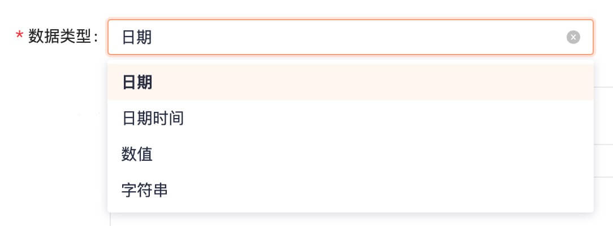

# DictSelect 字典下拉

当字典内容需要以下拉形式展示时，使用字典下拉组件，组件将缓存已有字典内容在Vuex中，不重复请求，刷新页面即可清除。

## 基本用法

适用大部分默认场景



```html
<SDictSelect 
  v-model="value" 
  dictType="DT_TYPE" 
  placeholder="请选择数据类型"
/>
```


## API

### Props

|参数|说明|类型|默认值|
|---|---|---|---|
|dictType|字典类型|`String`|-|


### Events

|事件名|说明|参数|
|---|---|---|
|change|当选中内容发生改变|`value`|
|load-success|当字典内容加载完成|`Array`|
