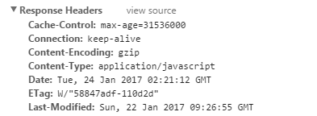
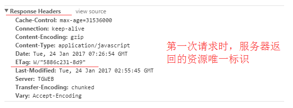

## Javascript 闭包

闭包是基于词法作用域书写代码时所产生的自然结果，甚至不需要为了利用它们而有意识地创建闭包。闭包的创建和使用在代码中随处可见。

### 变量的作用域

- 全局变量：函数内部可以直接读取全局变量

```js
var a = 1

function fun1() {
  console.log(a)
}

fun1() // 1
```

- 局部变量：函数外部无法读取函数内的局部变量

```js
function fun1() {
  var a = 1
}

console.log(a) // undefine
```

- 出于种种原因，有时候需要得到函数内的局部变量。但是，正常情况下，函数外部是无法读取函数内的局部变量，只有通过变通方法才能实现。那就是在函数的内部，再定义一个函数。

```js
function fun1() {
  var a = 1

  function fun2() {
    console.log(a) // 1
  }
}
```

```js
function fun1() {
  var a = 1

  function fun2() {
    console.log(a) // 1
  }

  return fun2
}
var result = fun1()

result() //1
```

::: tip
在上面一段代码中，函数 fun2 被包括在函数 fun1 的内部，这时 fun1 内部的所有局部变量，对 fun2 都是可读取的。但是反过来就不行，fun2 内部的局部变量，对 fun1 就是不可读取的。这就是 Javascript 语言特有的"链式作用域"结构，子对象会一级一级地向上寻找所有父对象的变量。所以，父对象的所有变量，对子对象都是可见的，反之则不成立。

既然 fun2 函数可以读取到 fun1 函数中的局部变量，那么只要把 fun2 函数作为返回值，就可以在 fun1 函数的外部读取它的内部变量了
:::

### 闭包的概念

- 当函数可以记住并访问所在的词法作用域时，就产生了闭包，使得函数是在当前词法作用域之外执行。

- 闭包就是能够读取其他函数内部变量的函数。

- 由于在 Javascript 语言中，只有函数内部的子函数才能读取局部变量，因此可以把闭包简单理解成"定义在一个函数内部的函数"。所以，在本质上，闭包就是将函数内部和函数外部连接起来的一座桥梁。

```js
function foo() {
  var a = 2
  function bar() {
    console.log(a)
  }
  return bar
}
var baz = foo()
baz() // 2 这就是闭包的效果。
```

::: tip
函数 bar()的词法作用域能够访问 foo()的内部作用域。然后我们将 bar()函数本身当作 一个值类型进行传递。在这个例子中，我们将 bar 所引用的函数对象本身当作返回值。
在 foo()执行后，其返回值(也就是内部的 bar()函数)赋值给变量 baz 并调用 baz()，实际上只是通过不同的标识符引用调用了内部的函数 bar()。
bar() 显然可以被正常执行。但是在这个例子中，它在自己定义的词法作用域以外的地方执行。
在 foo()执行后，通常会期待 foo()的整个内部作用域都被销毁，因为我们知道引擎有垃圾回收器用来释放不再使用的内存空间。由于看上去 foo()的内容不会再被使用，所以很自然地会考虑对其进行回收。
而闭包的“神奇”之处正是可以阻止这件事情的发生，事实上内部作用域依然存在，是 bar()本身在使用，因此没有被回收。
因为 bar()所声明的位置，它拥有涵盖 foo()内部作用域的闭包，使得该作用域能够一直存活，以供 bar()在之后任何时间进行引用。
bar()依然持有对该作用域的引用，而这个引用就叫作闭包。
:::

### 例子

```js
var name = '小明'

var object = {
  name: '小李',

  getNameFunc: function () {
    return function () {
      return this.name
    }
  },
}

console.log(object.getNameFunc()()) //小明
```

```js
var name = '小明'

var object = {
  name: '小李',

  getNameFunc: function () {
    var that = this
    return function () {
      return that.name
    }
  },
}

console.log(object.getNameFunc()()) //小李
```

- 本质上无论何时何地，如果将函数(访问它们各自的词法作用域)当作第一级的值类型并到处传递，你就会看到闭包在这些函数中的应用。在定时器、事件监听器、 Ajax 请求、跨窗口通信、Web Workers 或者任何其他的异步(或者同步)任务中，只要使用了回调函数，实际上就是在使用闭包!

## Http 缓存机制

### Http 报文

http 报文就是浏览器和服务器间通信时发送及响应的数据块。
浏览器向服务器请求数据，发送请求(request)报文；服务器向浏览器返回数据，返回响应(response)报文。报文信息主要分为两部分。

- 包含属性的首部(header)----附加信息（cookie，缓存信息等）与缓存相关的规则信息，均包含在 header 中
- 包含数据的主体部分(body)----http 请求真正想要传输的部分

### Http 缓存

- http 缓存是 http 性能优化中简单高效的一种优化方式了，缓存是一种保存资源副本并在下次请求时直接使用该副本的技术，当 web 缓存发现请求的资源已经被存储，它会拦截请求，返回该资源的拷贝，而不会去源服务器重新下载。一个优秀的缓存策略可以缩短网页请求资源的距离，减少延迟，节省网络流量，并且由于缓存文件可以重复利用，降低网络负荷，提高客户端响应。

### 缓存规则

::: tip
假设浏览器存在一个缓存数据库,用于存储本地缓存信息。在客户端第一次请求数据时，此时缓存数据库中没有对应的缓存数据，需要请求服务器，服务器返回后，将数据存储至缓存数据库中。
根据是否需要重新向服务器发起请求来分类，将 http 缓存规则分为两大类

- 强制缓存
- 对比缓存
  :::


#### 强制缓存

- 在浏览器已经缓存数据的情况下，使用强制缓存去请求数据的流程如下所示：
  
  :::tip

  从流程图可以看到，强制缓存，在缓存数据未失效的情况下，可以直接使用缓存数据，不需要再请求服务器，那么浏览器是如何判断缓存数据是否失效呢？
  对于强制缓存来说，响应 header 中会有两个字段来标明失效规则
  :::

- Expires:
  Expires 是 HTTP1.0 的产物了，现在默认浏览器均默认使用 HTTP 1.1，所以它的作用基本忽略。但是很多网站还是对它做了兼容。它的值为服务端返回的到期时间，即下一次请求时，请求时间小于服务端返回的到期时间，直接使用缓存数据。
  但有一个问题是到期时间是由服务端生成的，如果客户端时间跟服务器时间不一致，这就会导致缓存命中的误差。在 HTTP 1.1 的版本，Expires 被 Cache-Control 替代。

- Cache-Control:
  Cache-Control 是最重要的规则。常见的指令有 private、public、no-cache、max-age，no-store，默认为 private。

  1. max-age：用来设置资源（representations）可以被缓存多长时间，单位为秒；
  2. s-maxage：覆盖 max-age 或者 Expires 头，但是仅适用于共享缓存 (比如各个代理)，私有缓存会忽略它；
  3. max-stale：表明客户端愿意接收一个已经过期的资源。可以设置一个可选的秒数，表示响应不能已经过时超过该给定的时间。
  4. min-fresh：表示客户端希望获取一个能在指定的秒数内保持其最新状态的响应。
  5. public：表明响应可以被任何对象（包括：发送请求的客户端，代理服务器，等等）缓存，即使是通常不可缓存的内容。（例如：1.该响应没有 max-age 指令或 Expires 消息头；2. 该响应对应的请求方法是 POST )；
  6. private：表明响应只能被单个用户缓存，不能作为共享缓存（即代理服务器不能缓存它）。私有缓存可以缓存响应内容，比如：对应用户的本地浏览器；
  7. no-cache：在发布缓存副本之前，强制要求缓存把请求提交给原始服务器进行验证 (协商缓存验证)。
  8. no-store：缓存不应存储有关客户端请求或服务器响应的任何内容，即不使用任何缓存。

##### 举例子 🌰：

比如下图的资源响应头是：Cache-Control: public, max-age= 31536000，那么这个资源会被缓存 31536000 秒（365 天），在 365 天内再次请求这条数据，都会直接获取缓存数据库中的数据，直接使用。


- 这张图的 Cache-Control: no-cache, no-store, max-age=0, must-revalidate,表示客户端可以缓存资源，每次使用缓存资源前都必须重新验证其有效性。这意味着每次都会发起 HTTP 请求，但当缓存内容仍有效时可以跳过 HTTP 响应体的下载，不使用任何缓存。
  

#### 对比缓存

- 已存在缓存数据时，使用对比缓存去请求数据的流程如下所示：
  
  对比缓存，顾名思义，需要进行比较判断是否可以使用缓存。
  浏览器第一次请求数据时，服务器会将缓存标识与数据一起返回给浏览器，浏览器将二者备份至缓存数据库中。
  当浏览器再次请求数据时，浏览器将备份的缓存标识发送给服务器，服务器根据缓存标识进行判断，判断成功后，返回 304 状态码，通知客户端比较成功，可以使用缓存数据

##### 举例子 🌰

通过下面两张图的对比，可以很清楚的发现，在对比缓存生效时，状态码为 304，并且报文大小和请求时间大大减少。
原因是服务端在进行标识比较后，只返回 header 部分，通过状态码通知客户端使用缓存，不再需要将报文主体部分返回给客户端。


:::tip
对于对比缓存来说，缓存标识的传递是我们着重需要理解的，它在请求 header 和响应 header 间进行传递，
一共分为两种标识传递，是分别成对出现的，呈一一对应关系。

- Last-Modified/If-Modified-Since
- Etag/If-None-Match（优先级高于 Last-Modified/If-Modified-Since）
  :::

  - Last-Modified：服务器在响应请求时，告诉浏览器资源的最后修改时间。
    
  - If-Modified-Since：再次请求服务器时，通过此字段通知服务器上次请求时，服务器返回的资源最后修改时间。
    服务器收到请求后发现有头 If-Modified-Since 则与被请求资源的最后修改时间进行比对。
    若资源的最后修改时间大于 If-Modified-Since，说明资源又被改动过，则响应整片资源内容，返回状态码 200；
    若资源的最后修改时间小于或等于 If-Modified-Since，说明资源无新修改，则响应 HTTP 304，告知浏览器继续使用所保存的 cache。
    
  - Etag：服务器响应请求时，告诉浏览器当前资源在服务器的唯一标识（生成规则由服务器决定）。
    
  - If-None-Match：再次请求服务器时，通过此字段通知服务器客户段缓存数据的唯一标识。服务器收到请求后发现有头 If-None-Match 则与被请求资源的唯一标识进行比对，如果不同说明资源又被改动过，则响应整片资源内容，返回状态码 200；如果相同说明资源无新修改，则响应 HTTP 304，告知浏览器继续使用所保存的 cache。
    

:::tip
对于强制缓存，服务器通知浏览器一个缓存时间，在缓存时间内，下次请求，直接用缓存，不在时间内，执行比较缓存策略。
对于比较缓存，将缓存信息中的 Etag 和 Last-Modified 通过请求发送给服务器，由服务器校验，返回 304 状态码时，浏览器直接使用缓存。
强制缓存如果生效，不需要再和服务器发生交互，而对比缓存不管是否生效，都需要与服务端发生交互。
两类缓存规则可以同时存在，强制缓存优先级高于对比缓存，也就是说，当执行强制缓存的规则时，如果缓存生效，直接使用缓存，不再执行对比缓存规则。
:::
