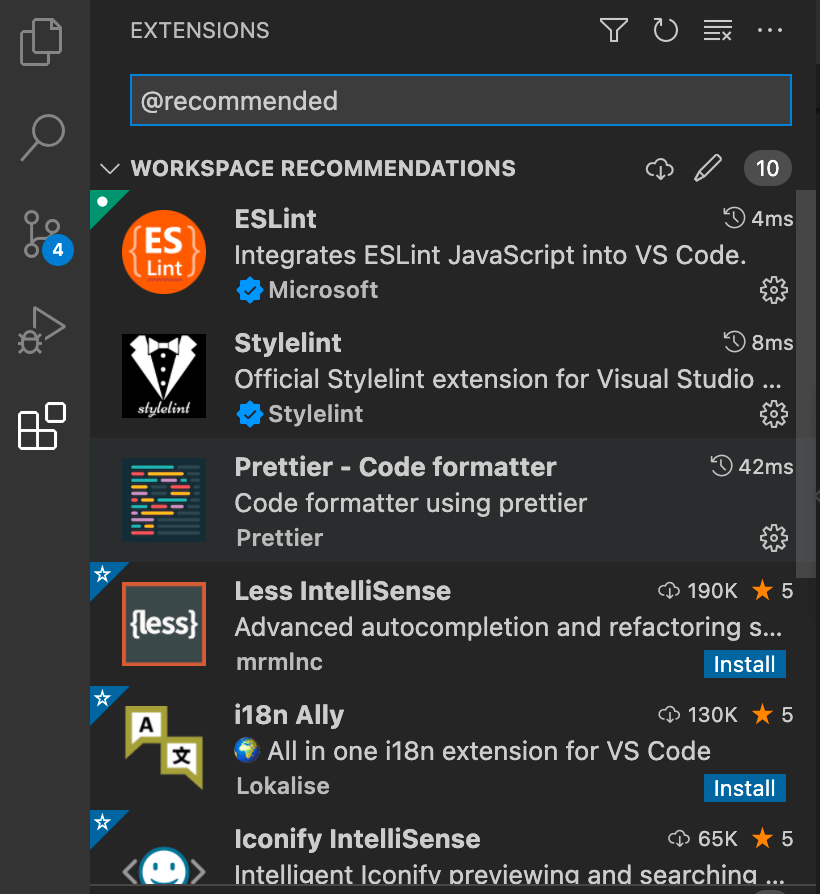
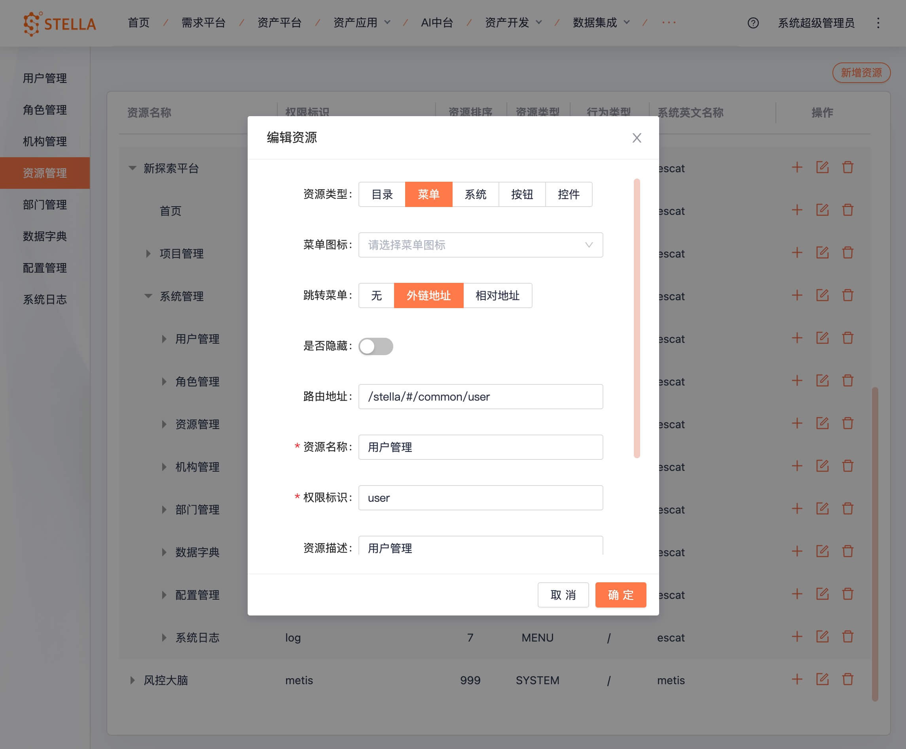

# Vue3 新框架&组件

## 目录说明
``` 
├── build # 打包脚本相关
│   ├── config # 配置文件
│   ├── generate # 生成器
│   ├── script # 脚本
│   └── vite # vite配置
├── mock # mock文件夹
├── public # 公共静态资源目录
├── src # 主目录
│   ├── api # 接口文件
│   ├── assets # 资源文件
│   │   ├── icons # icon sprite 图标文件夹
│   │   ├── images # 项目存放图片的文件夹
│   │   └── svg # 项目存放svg图片的文件夹
│   ├── components # 公共组件
│   ├── design # 样式文件
│   ├── directives # 指令
│   ├── enums # 枚举/常量
│   ├── hooks # hook
│   │   ├── component # 组件相关hook
│   │   ├── core # 基础hook
│   │   ├── event # 事件相关hook
│   │   ├── setting # 配置相关hook
│   │   └── web # web相关hook
│   ├── layouts # 布局文件
│   │   ├── default # 默认布局
│   │   ├── iframe # iframe布局
│   │   └── page # 页面布局
│   ├── locales # 多语言
│   ├── logics # 逻辑
│   ├── main.ts # 主入口
│   ├── router # 路由配置
│   ├── settings # 项目配置
│   │   ├── componentSetting.ts # 组件配置
│   │   ├── designSetting.ts # 样式配置
│   │   ├── encryptionSetting.ts # 加密配置
│   │   ├── localeSetting.ts # 多语言配置
│   │   ├── projectSetting.ts # 项目配置
│   │   ├── siteSetting.ts # 站点配置
│   │   └── routerPermissionSettting.ts # 菜单权限与路由页面路径映射
│   ├── store # 数据仓库
│   ├── utils # 工具类
│   └── views # 页面
├── test # 测试
│   └── server # 测试用到的服务
│       ├── api # 测试服务器
│       ├── upload # 测试上传服务器
│       └── websocket # 测试ws服务器
├── types # 类型文件
├── vite.config.ts # vite配置文件
└── windi.config.ts # windcss配置文件
```

## 开发工具配置
::: tip
项目内已配置好规则与依赖插件，详见 `.vscode` 文件夹中设置

推荐依赖安装：`VSCode` -> `扩展` -> 输入 `@recommended` -> 安装工作区推荐插件
:::



## 子平台配置
平台信息配置，区分子平台资源权限等
``` ts
// .env
# 平台标识 nodeEnName
VITE_PLATFORM = escat
```

## 系统管理模块配置
::: tip
因为Vue3新项目与旧项目代码不兼容，`系统管理`模块为iframe引入展示，`资源管理`中配置菜单时，注意需要将资源中`跳转菜单`指定为`外链地址`模式并设置`路由地址`；如设置系统管理下的用户管理：`/stella/#/common/user`，即可正常使用
:::



## 路由兼容配置&动态路由改造
新版本中将不需要再手动定义路由，只需在`系统管理/资源管理`配置菜单资源即可；为兼容旧平台资源权限管理，需配置`菜单权限标识/nodeEnName`与路由页面路径数据映射，如：
``` ts
// src/setting/routerPermissionSettting.ts

export default {
  home: '/home/index',
  'project-list': '/project/project-manage/index',
  'group-list': '/project/group/index',
  'run-list': '/project/run/index',
  workbench: '/project/workbench/index',
}
```

## Api 创建
在 `src/api` 中创建模块文件夹如：`project`，添加对应的文件如：`group.ts`；添加数据模型文件夹 `model`，以及对应的模型文件 `group.ts` :
``` ts
// project/model/group.ts
import { BasicPageParams } from '/@/api/model/baseModel'

// 分页接口需继承基础分页参数：BasicPageParams
export interface GetGroupParams extends BasicPageParams {
  groupName?: string
}

// project/group.ts
import { defHttp } from '/@/utils/http/axios'
import { GetGroupParams } from './model/group'
import { BasicResult } from '../model/baseModel'

enum Api {
  GetGroup = '/escat-common-group-provider/group/selectLikeBy/TSJB',
  // ...
}

/**
 * @description: 获取分组列表（API命名需明确后缀Api，方便与其他函数区分，如GetListApi、GetDetailByIdApi）
 */
export function getGroupApi(params: GetGroupParams) {
  return defHttp.get<BasicResult>({ url: Api.GetGroup, params: params })
}
```

## 列表页面模板 


`pageTable.vue` 完整代码
``` vue
<template>
  <BasicTable
    @register="registerTable"
    :rowSelection="{ type: 'checkbox', selectedRowKeys, onChange: onSelectChange }"
  >
    <!-- 页面标题&操作 -->
    <template #pageTitle>
      <a-button type="primary">
        <template #icon><Icon icon="plus" /></template>新建分组
      </a-button>
    </template>

    <!-- 页面查询筛选 -->
    <template #pageFilters>
      <a-input placeholder="分组名称" v-model:value="searchInfo.groupName" />
      <a-select placeholder="请选择" />
      <FilterPopover @reset="resetForm">
        <FilterPopoverItem label="创建人">
          <a-input placeholder="请输入创建人名称" />
        </FilterPopoverItem>
        <FilterPopoverItem label="单选">
          <a-select placeholder="请选择单选" allow-clear>
            <a-select-option :key="1">测试1</a-select-option>
            <a-select-option :key="2">测试2</a-select-option>
            <a-select-option :key="3">测试3</a-select-option>
          </a-select>
        </FilterPopoverItem>
        <FilterPopoverItem label="多选">
          <a-select mode="multiple" placeholder="请选择多选" :show-arrow="true">
            <a-select-option key="测试1">测试1</a-select-option>
            <a-select-option key="测试2">测试2</a-select-option>
            <a-select-option key="测试3">测试3</a-select-option>
          </a-select>
        </FilterPopoverItem>
        <FilterPopoverItem label="创建时间">
          <a-date-picker />
        </FilterPopoverItem>
        <FilterPopoverItem label="结束时间">
          <a-date-picker />
        </FilterPopoverItem>
        <FilterPopoverItem label="运行时间">
          <a-range-picker format="YYYY-MM-DD" :placeholder="['创建时间', '结束时间']" />
        </FilterPopoverItem>
      </FilterPopover>
      <a-button type="primary" @click="fetch">查询</a-button>
    </template>

    <!-- 页面操作功能 -->
    <template #pageActions>
      <ActionButton :disabled="selectedRowKeys.length === 0" disabledText="请选择要操作的数据">批量删除</ActionButton>
    </template>

    <!-- 表格操作功能 -->
    <template #action="{ record }">
      <TableAction :actions="getTableActions(record)" />
    </template>

    <!-- 表格列自定义 -->
    <template #bodyCell="{ column, record }">
      <template v-if="column.dataIndex === 'groupName'">
        <span class="success-color">自定义：{{ record.groupName }} </span>
      </template>
    </template>
  </BasicTable>
</template>

<script lang="ts">
  import { defineComponent, reactive, ref } from 'vue'
  // 图标组件
  import Icon from '/@/components/Icon'
  import ActionButton from '/@/components/ActionButton'
  // 表格插件
  import {
    BasicTable,
    useTable,
    TableAction,
    ActionItem,
    isActionColumnHidden,
  } from '/@/components/Table'

  import { FilterPopover, FilterPopoverItem } from '/@/components/filter-popover'
  // 表格中的类型
  import type { BasicColumn, Key } from '/@/components/Table/src/types/table'
  // 表格列配置
  const columns: BasicColumn[] = [
    {
      title: '分组名称',
      resizable: true,
      dataIndex: 'groupName',
      minWidth: 120,
      width: 120,
      fixed: 'left',
    },
    {
      title: '分组描述',
      resizable: true,
      dataIndex: 'describe',
      minWidth: 120,
      width: 120,
    },
    {
      title: '项目数量',
      resizable: true,
      dataIndex: 'projectCount',
      minWidth: 120,
      width: 120,
    },
    {
      title: '分组排序',
      resizable: true,
      dataIndex: 'groupOrder',
      minWidth: 120,
      width: 120,
    },
    {
      title: '创建人',
      resizable: true,
      dataIndex: 'createUserName',
      minWidth: 180,
      width: 180,
    },
    {
      title: '创建时间',
      dataIndex: 'createTime',
      minWidth: 180,
      width: 200,
      sorter: true,
      resizable: true,
    },
    {
      title: '修改人',
      resizable: true,
      dataIndex: 'updateUserName',
      minWidth: 180,
      width: 200,
    },
    {
      title: '修改时间',
      resizable: true,
      dataIndex: 'updateTime',
      minWidth: 180,
      width: 200,
    },
  ]

  // API
  import { getGroupApi } from '/@/api/project/group'
  import type { GetGroupParams } from '/@/api/project/model/group'

  export default defineComponent({
    // 组件
    components: {
      BasicTable,
      TableAction,
      Icon,
      ActionButton,
      FilterPopover,
      FilterPopoverItem,
    },
    setup() {
      // 查询筛选参数
      const searchInfo = reactive<GetGroupParams>({
        groupName: '',
        // ...
      })

      // 操作列配置及所有权限
      const getTableActions = (record?) => {
        // 操作列方法
        return [
          {
            label: '编辑', // 名称或提示
            icon: 'edit-square', // 图标
            loading: false, // 是否loading状态
            disabled: record?.groupName === 'w9', // 是否禁用
            onClick: () => {
              console.log('编辑', record)
              reload()
            },
            permission: 'b_log_query', // 根据权限控制是否显示: 无权限，不显示
          },
          {
            label: '删除',
            icon: 'delete',
            permission: 'b_log_query', // 根据权限控制是否显示: 有权限，会显示
          },
          {
            label: '删除',
            icon: 'delete',
            permission: 'b_log_query', // 根据权限控制是否显示: 有权限，会显示
          },
          {
            label: '启用',
            icon: 'yunhang',
            // 根据业务控制是否显示，如: 非enable状态的不显示启用按钮
            ifShow: (_action) => {
              return record.status !== 'enable'
            },
          },
          {
            label: '禁用',
            // 根据业务控制是否显示，如: enable状态的显示禁用按钮
            ifShow: () => {
              return record.status === 'enable'
            },
          },
          {
            label: '查看',
            icon: 'filesearch',
            ifShow: true,
            disabled: record?.groupName === '分组1', // 是否禁用
            disabledText: '你不能查看', // 禁用提示
            onClick: () => {
              console.log('查看', record)
            },
          },
        ] as ActionItem[]
      }

      // 表格组件配置
      const [registerTable, { reload }] = useTable({
        pageTitle: '在列表页面的Title、Filter、Action、Table等使用样例', // 页面标题
        api: Api, // API命名后缀明确如：getGroupApi
        searchInfo, // 查询参数
        // 默认排序字段
        defSort: {
          field: 'createTime', // 排序字端
          order: 'ascend', // 排序方式 ascend | descend
        },
        useSearchForm: true, // 是否使用查询过滤器
        showIndexColumn: false, // 是否展示序号
        columns, // 表格列配置
        // 操作列配置
        actionColumn: {
          defaultHidden: isActionColumnHidden(getTableActions()), // 操作列判断权限是否隐藏
        },
      })

      // 查询
      const fetch = () => {
        reload({ page: 1, searchInfo })
      }

      // 重制过滤筛选表单
      const resetForm = () => {
        console.log('重制过滤筛选表单')
      }

      // 选中项keys
      const selectedRowKeys = ref<Key[]>([])

      // 行选中事件
      function onSelectChange(keys: Key[]) {
        selectedRowKeys.value = keys
      }

      // 返回的变量、函数
      return {
        searchInfo,
        selectedRowKeys,
        registerTable,
        getTableActions,
        fetch,
        resetForm,
        onSelectChange,
      }
    },
  })
</script>

```


## 表格组件
参考[vben admin](https://vvbin.cn/next/#/comp/basic)及[ant design](https://www.antdv.com/components/table-cn#API)中的Table使用案例，如[可编辑行](https://vvbin.cn/next/#/comp/table/editRowTable)、[树形表格](https://vvbin.cn/next/#/comp/table/treeTable)、[表格Api](https://www.antdv.com/components/table-cn#API)等

项目内置demo见 `Stella代码样例` ：
- 普通表格（包含表格常见配置使用例子）
- 列表模板（列表模板表格使用例子）
- 选项卡列表模板（选项卡模板表格使用例子）
- 弹窗表格（弹窗中表格的使用）
- 可编辑行表格（可编辑修改的表格）

## 状态颜色

不同状态的颜色区分，比如表格状态列中的颜色使用。

::: demo

```html
<template>
  <p>
    <span class="success-color">成功</span>
    <span style="font-size: 14px;color: #666;"> -- 表示成功、通过、启用的状态颜色</span>
  </p>
  <p>
    <span class="fail-color">失败</span>
    <span style="font-size: 14px;color: #666;"> -- 表示失败、拒绝的状态颜色</span>
  </p>
  <p>
    <span class="progress-color">进行中</span>
    <span style="font-size: 14px;color: #666;"> -- 表示运行中、进行中等状态颜色</span>
  </p>
  <p>
    <span class="disabled-color">失效</span>
    <span style="font-size: 14px;color: #666;"> -- 表示失效、失败、禁用的状态颜色</span>
  </p>
  <p>
    <span>默认</span>
    <span style="font-size: 14px;color: #666;"> -- 表示已完成、就绪、异常中止等状态颜色</span>
  </p>
</template>

:::


## 图标组件
`Iconfont` 图标库，通过 `Font Class` 方式引用，添加新图标登录`Iconfont` 在 `senses-icons` 项目中添加更新


``` ts
// 引入 & 使用
import Icon from '/@/components/Icon/index'

<Icon icon="actions-dot-mark" :size="16" />
<Icon icon="delete" :size="20" />
```

## 页面标题&操作
左侧标题区、右侧操作区
``` html
<PageTitle title="页面标题">
  <a-button type="primary">
    <template #icon><Icon icon="plus" /></template>新建分组
  </a-button>
</PageTitle>
```

## 页面查询筛选&页面操作功能
左侧查询筛选区、右侧操作区
``` html
<PageHandle>
  <!-- 页面查询筛选 -->
  <template #filters>
    <a-input placeholder="分组名称" v-model:value="searchInfo.groupName" />
    <a-select placeholder="请选择" />
    <FilterPopover @reset="resetForm">
      <FilterPopoverItem label="创建人">
            <a-input placeholder="请输入创建人名称" />
          </FilterPopoverItem>
    </FilterPopover>
    <a-button type="primary" @click="fetch">查询</a-button>    
  </template>
  <!-- 页面操作功能 -->
  <template #actions>
    <ActionButton :disabled="selectedRowKeys.length === 0" disabledText="请选择要删除的数据">批量删除</ActionButton>
  </template>
</PageHandle>
```

## Permission 权限标识
根据用户角色中配置的资源，区分权限展示资源

### 根据权限标识获取资源名称
``` ts
// 引入 & 使用
import { usePermission } from '/@/hooks/web/usePermission';
const { p } = usePermission();

// ts中使用，如：
p('nodeEnName')

// template中使用，如：
<a-button v-permission="'nodeEnName'">{{p('nodeEnName')}}</a-button>
```

### 指令方式验证权限
``` ts
// 单个权限验证，存在即为true
v-permission="'nodeEnName'"

// 权限组验证，有一个即为true
v-permission="['nodeEnName1', 'nodeEnName2']"
```

### 函数方式验证权限
``` ts
// 引入 & 使用
import { usePermission } from '/@/hooks/web/usePermission';
const { hasPermission } = usePermission();

// 单个权限验证，存在即为true
hasPermission('nodeEnName')

// 权限组验证，有一个即为true
hasPermission(['nodeEnName1', 'nodeEnName2'])
```


## 获取远程资源&图片地址、获取源地址
``` ts
// 使用
import { useAssetPath, useOrigin } from '/@/hooks/web/useAsset'

// 使用平台logo


// 获取当前服务环境（区分开发环境和生成环境）
useOrigin()

// useAsset.ts
/**
 * @description: 获取远程静态资源地址
 * @param {string} src
 * @return {string}
 */
export function useAssetPath(src: string): string {
  return `${useOrigin()}/static/${src}`
}

/**
 * @description: 区分环境获取当前服务源
 * @return {string}
 */
export function useOrigin(): string {
  return import.meta.env.DEV ? import.meta.env.VITE_GLOB_DEV_URL : window.origin
}
```

## 禁用按钮规则
当按钮被禁用时，需要以tooltip提示禁用的说明信息（ActionButton、TableAction都已配置disabledText属性，当按钮被禁用时则显示禁用提示）
``` ts
// ActionButton 使用
import { ActionButton } from '/@/components/ActionButton'

<ActionButton :disabled="selectedRowKeys.length === 0" disabledText="请选择要删除的数据">批量删除</ActionButton>

// TableAction 配置项
{
  label: '查看',
  icon: 'filesearch',
  disabled: record?.groupName === 'xxx', // 是否禁用
  disabledText: '你不能查看', // 禁用提示
  onClick: () => {
    console.log('查看', record)
  }
}
```

## 复制功能
``` ts
// 引入 & 使用
import { useCopyToClipboard } from '/@/hooks/web/useCopyToClipboard';

const { clipboardRef, copiedRef } = useCopyToClipboard();

function handleCopy() {
    clipboardRef.value = 'testCopyValue';
    if (unref(copiedRef)) {
      createMessage.warning('copy success！');
    }
}
```

## 环境变量
``` ts
// 是否开发环境
import.meta.env.DEV

// 是否生产环境
import.meta.env.PROD

// 当前环境变量
import.meta.env.MODE

// 开发服务器地址
import.meta.env.VITE_GLOB_DEV_URL
```
